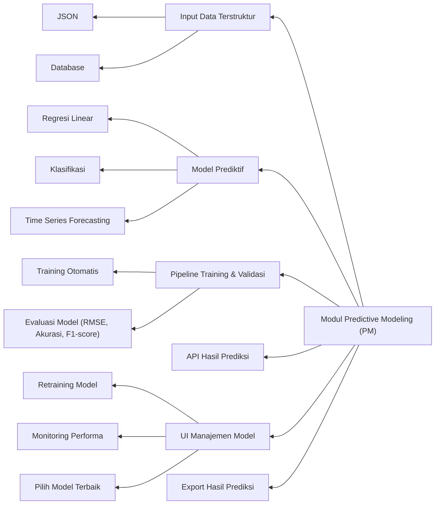

# RANTAI MODEL PREDI

Selamat datang di repository modul Predictive Modeling (PM), bagian dari platform analytics end-to-end yang mengaplikasikan teknik machine learning untuk memberikan prediksi dan rekomendasi bisnis berbasis data historis.

---

## Tentang

Modul PM bertugas membuat model prediktif menggunakan algoritma machine learning seperti regresi, klasifikasi, dan time series forecasting. Modul ini menyediakan pipeline otomatis untuk pelatihan, validasi, serta penyajian hasil prediksi yang dapat diintegrasikan ke dashboard Business Intelligence (BI).

> Visi: Menjadi platform prediktif yang handal dan mudah digunakan, memberdayakan bisnis untuk mengambil keputusan strategis berbasis data dan kecerdasan buatan.

---

## Fitur

- Terima input data terstruktur hasil EDA (JSON atau database)

- Model standar: regresi linear, klasifikasi, forecasting time series

- Pipeline otomatis untuk training, validasi, dan evaluasi model (RMSE, akurasi, F1-score)

- API untuk akses hasil prediksi secara real-time dari dashboard BI

- UI untuk manajemen model: training ulang, monitoring performa, pemilihan model terbaik

- Export hasil prediksi dalam format JSON atau langsung tampil di BI dashboard



---

## Instalasi

Prasyarat
- Python >= 3.9

- Docker (opsional untuk deployment)

- Database PostgreSQL/MySQL (opsional)

Langkah Instalasi
1. Clone repository ini:
```bash
git clone https://github.com/mrbrightsides/rantai-model-predi.git
cd pm-module
```

2. Instal semua dependensi:
```bash
pip install -r requirements.txt
```

3. Konfigurasi file .env untuk koneksi database dan API key (jika ada).

4. Jalankan aplikasi:
```bash
uvicorn main:app --reload
```

---

## Penggunaan

- Akses dashboard PM pada https://rantai-model-predi.streamlit.app/

- Gunakan API untuk mengirim data dan mendapatkan hasil prediksi

- Manajemen model lewat UI untuk retraining dan evaluasi performa

- Integrasi hasil prediksi langsung ke dashboard BI untuk BI

---

## Teknologi

- Python: scikit-learn, TensorFlow, PyTorch, FastAPI

- Frontend: React/Vue (opsional untuk UI manajemen model)

- Database: PostgreSQL/MySQL (opsional)

---

## Kontribusi
Fork repo, buat branch fitur baru, commit, push, dan buat pull request. Pastikan kode mengikuti standar dan sudah dites.

- Fork repository

- Buat branch fitur baru: git checkout -b feature/nama-fitur

- Commit perubahan Anda: git commit -m 'Tambah fitur baru'

- Push ke branch Anda: git push origin feature/nama-fitur

- Buat pull request di repository ini

- Harap pastikan kode teruji dan mengikuti style yang sudah ada.

---

## Lisensi

Proyek ini dilisensikan di bawah MIT License - baca file LICENSE untuk informasi lebih lanjut.
